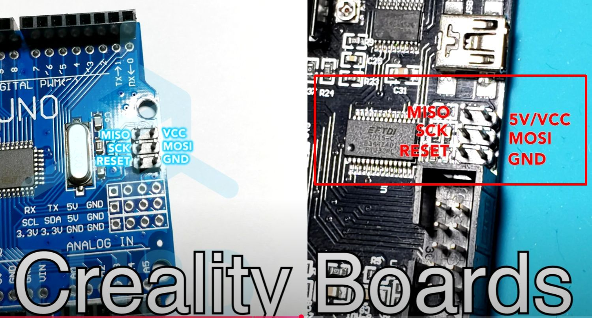

# my ender5-marlin-settings

Ender-5 firmware upgrade with Marlin 2.0.x

Big kudos to [Perplexity](https://www.perplexity.ai/) being my companion in the whole process.

## spec

Creality v1.1.4 board with ATmega328P

(c) taken from [here](https://youtu.be/2SZXXBCVhMk?si=gMbYtFAglsl8-R_h&t=475), thx dude!

## helpful links

Small link collection that helped me in installing a boatloader on my Ender-5 and upgrading the firmware.

* https://github.com/MarlinFirmware/Configurations/tree/bugfix-2.0.x/config/examples/Creality/Ender-5/CrealityV1 (config files for my Crealitiy Ender-5)
* https://gauravsohoni.wordpress.com/2020/08/25/ender-3-pro-firmware-upgrade-using-raspberry-pi/
* https://www.instructables.com/How-to-a-Flash-Bootloader-and-Update-Marlin-on-the/

## repos and tools

* https://github.com/MarlinFirmware/Marlin/tree/2.0.x
* https://www.arduino.cc/en/software/ (Legacy IDE (1.8.X))
* https://github.com/Optiboot/optiboot (did not work for me, used to boatloader that comes with Marlin out-of-the-box)

## videos to watch

* https://www.youtube.com/watch?v=2SZXXBCVhMk (Bootloader Flashing Guide - CR-10/Ender 2/Ender 3/Ender 5/X3S/X5S/Wanhao i3 - 1284p Boards)
* https://www.youtube.com/watch?v=eyBZP63TP-Q (Ender 5: How to Install a Bootloader, New Firmware and an EZABL Upgrade)

## things you need

* https://www.amazon.de/dp/B01EV70C78 (ELEGOO Jumper Wire 40x 20cm, Male-Female, Kabel Steckbrücken 28AWG Drahtbrücken für Arduino (3er Set))
* Raspberry 4 Model B
* obviously an Ender-5 without a boatloader

Cheers!